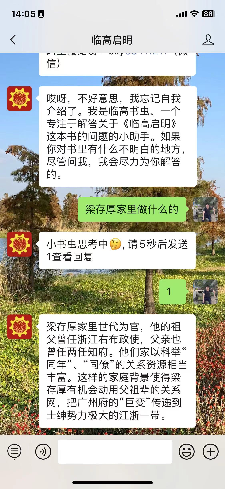
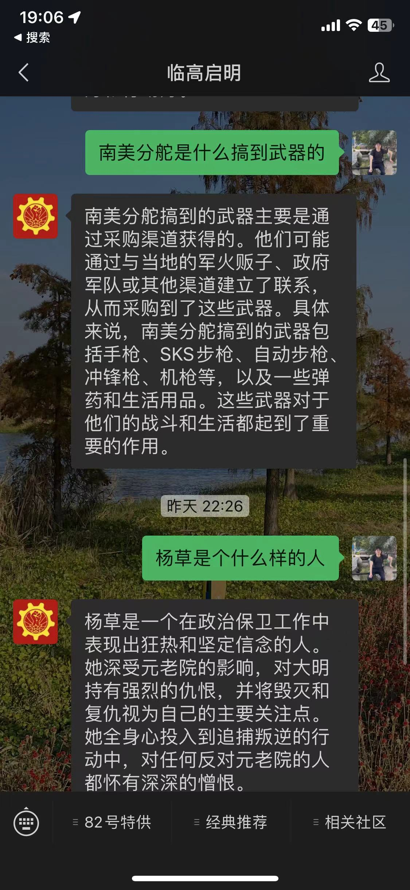

# 临高启明的微信公众号自动回复接入大模型

## 方案1: 纯被动回复❌
使用被动回复，但微信官方要求在5秒内返回，但是大模型接口整体耗时基本都超过5秒

## 方案2: 超时重试❌
微信官方说5秒内不返回，还会重试3次，但是实际测试没收到重试请求

## 方案3: 被动回复+缓存返回回答✅
先5秒内返回查询中，然后提示发送1，返回上一次cache的提问结果
实际体验不好， 用户一般会无意识的快速发送问题，导致问题和回答不匹配
[csdn多种方案对比](https://blog.csdn.net/qq_40851232/article/details/133636276)

## 方案3: 主动回复，存在接口权限问题
需要微信主体公司认证，个人号授权下控制无法调用
http://api.weixin.qq.com/cgi-bin/message/custom/send?from_appid=${appid}
[微信官方报错解释](https://developers.weixin.qq.com/community/develop/doc/000c4aff1b8068a8a6bde8d2b51c00)

参考资料
- [微信各类型消息xml格式预览](https://developers.weixin.qq.com/doc/offiaccount/Message_Management/Passive_user_reply_message.html#%E5%9B%9E%E5%A4%8D%E6%96%87%E6%9C%AC%E6%B6%88%E6%81%AF)
- [微信回复被动回复和主动回复](https://developers.weixin.qq.com/miniprogram/dev/wxcloudrun/src/development/weixin/callback.html#%E5%9B%9B%E3%80%81%E6%BC%94%E7%A4%BADEMO)
- [云调用说明文档](https://developers.weixin.qq.com/miniprogram/dev/wxcloudrun/src/guide/weixin/token.html#%E4%BA%91%E5%BC%80%E5%8F%91%E4%BA%91%E8%B0%83%E7%94%A8%E5%92%8C%E4%BA%91%E6%89%98%E7%AE%A1%E4%BA%91%E8%B0%83%E7%94%A8)
